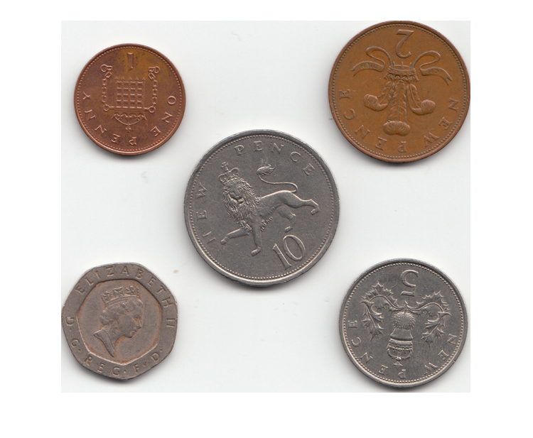

# Motivation

- Erkennung von geometrischen Figuren in Bildern.
- Ursprünglich zur Erkennung von Linien entwickelt.
- Anwendbar auf diverse geometrische Figuren, z. B. auch Kreise.
- Bedingt eine Vorverarbeitung mit einem Kantenfilter (_Sobel_, _Canny_, o. Ä.).

# Historisches

- **Peter Hough** - späte 50er, Patentanmeldung des Verfahrens im Jahre 1962.
- Ursprünglich zur maschinellen Analyse von Bildern aus Blasenkammern entwickelt.
- Teilchen in einer Blasenkammer ziehen lineare Spuren hinter sich her.
- Anhand eines Bildes bspw. Eintrittswinkel des Teilchens bestimmen.

# Grundidee

- geometrische Figuren lassen sich durch Parameter beschreiben
  - _Linie_: Punkt und Winkel
  - _Kreis_: Mittelpunkt und Radius
- Transformation des Bildes in den _Hough-Raum_
  - Raum der Figurenparameter
  - "Votingverfahren" über die wahrscheinlichsten Parameter einer Figur

# Parameter einer Linie: Erster Ansatz

$$
  y = mx + b
$$

- $m$ - Geradensteigung
- $b$ - Schnittpunkt der $y$-Achse
- **Nachteil**: $m$ kann bei vertikalen Linien unendlich sein,
  folglich wäre auch der Parameterraum unbegrenzt.

# Parameter einer Linie: Zweiter Ansatz

$$
  (r, \theta)
$$

- $r$ - Länge der Normalen der Linie zum Ursprung
- $\theta$ - Winkel der Normalen zur $x$-Achse 
- Parametrierung auch bekannt als _Hesse'sche Normalform_ einer Geradengleichung
- **Vorteil**: Kein unbegrenzter Parameterraum, $r$ ist beschränkt auf Bildgröße und $0 \leq \theta < 2\pi$

# Der Generalized Hough Transform (GHT)

- Erweiterung durch Dana H. Ballard, 1981
- Detektion von beliebigen geometrischen Figuren,
  die nicht durch Gleichungen parametriert sein müssen
- Besteht aus zwei Teilen:
  - Vorausberechnung einer Modelltabelle (_R-Table_)
  - Votingverfahren mittels Modelltabelle und Bild (Input)

# Grafik: Berechnung der Modelltabelle

{ width=60% }

| i | $\phi_i$      | $R_{\phi_i}$                    |
|---|---------------|---------------------------------|
| 0 | 0             | $(r_{11}, \alpha_{11}), \ldots$ |
| 1 | $\Delta\phi$  | $(r_{21}, \alpha_{21}), \ldots$ |
| 2 | $2\Delta\phi$ | $(r_{31}, \alpha_{31}), \ldots$ |
|   | $\ldots$      |                                 |

# Algorithmus: Berechnung der Modelltabelle

- Wähle Referenzpunkt $(p_x, p_y)$
- Erstelle Tabelle mit Indizes $i\Delta\phi$, $i \in \{0, \ldots, n\}$
- Für alle Randpunkte des Objekts $x$:
  - berechne den Gradientenwinkel $\phi$
  - berechne die Länge $r_{ij}$ und den Winkel $\alpha_{ij}$ der Verbindungsgeraden zum Referenzpunkt
  - füge das Tupel $(r_{ij}, \alpha_{ij})$ dem Index $i\Delta\phi$ hinzu, das am nächsten am Gradientenwinkel $\phi$ liegt

# Algorithmus: Objektsuche

- Initialisiere die Hough-Matrix aller Bildpunkte 

$$
  A(x, y) = 0
$$

- Durchlaufe die Pixel aller gefundenen Kanten im Bild
- Berechne zu jedem Kantenpixel den Gradientenwinkel $\phi$ und finde den passenden Bereich $\phi_i$ in der Tabelle
- Aus Position und Gradientenwinkel $\phi_i$, berechne für alle Tabelleneinträge mit $\phi_i$:

\begin{center}
  $x_c = x_i \pm r_{ij} \cos \alpha_{ij}$ \\
  $y_c = y_i \pm r_{ij} \sin \alpha_{ij}$
\end{center}

- Inkrementiere $A(x_c, y_c)$ um 1

# Parametrierung der Modelltabelle

- Allgemeine Parametrierung des Objekts durch $\{\theta, s\}$:
  - $\theta$ - Orientierungswinkel des Objekts
  - $s = (s_x, s_y)$ - Skalierungsfaktoren in $x$- und $y$-Richtung
- Leicht durchführbare Transformationen der Punkte $(r_{ij}, \alpha_{ij})$

# Demo: Kreise finden mit der Hough-Transformation

{ width=49% } { width=49% }
